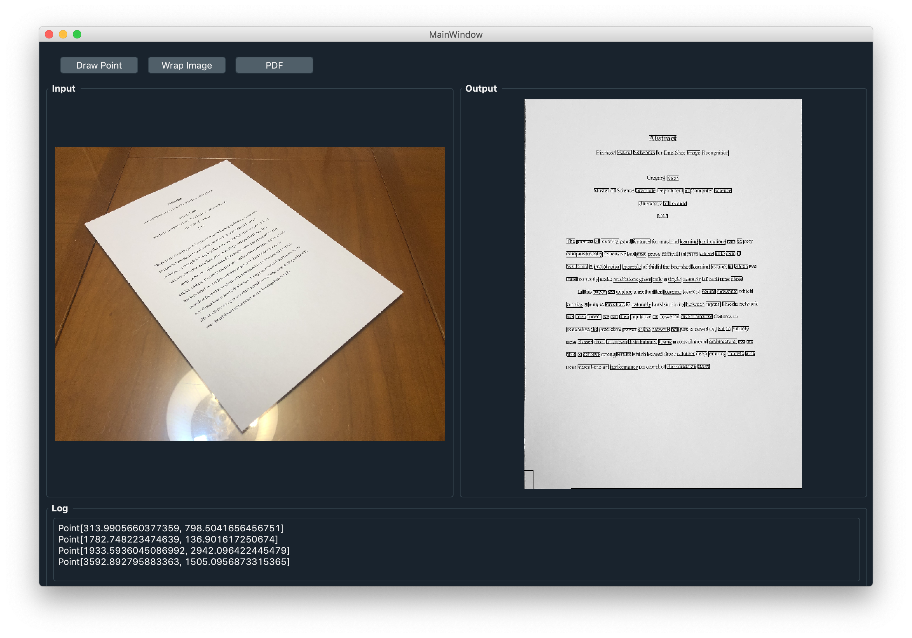

## Words Detect System
This is a Word Detect System based on `Tesseract`. Written in python3.7. User can capture image from the phone or whatever capture image devices. No need to adjust the shoot angle to top view. Then User can use this program to transform image into top view and export document to PDF.

### Dependencies
- `python` >= 3.5
- Required Packages: use `pip3 install <below_package>`
    - `PyQT5`
    - `cv2`
    - `numpy`
    - `pandas`
    - `matplotlib`
    - `fpdf`
    - `pytesseract`: This need to install pytesseract core engine.
        - `sudo apt-get install tesseract`

### Usage
After cloning this project, cd to this folder then type `python3 main.py`.Then Program will show up, use top tool bar to import images. Then draw four point of the document. After that, `wrap image` will transform and detect image and output result to the right window. Finally, use `PDF` to export document to the PDF.

### Screenshot

